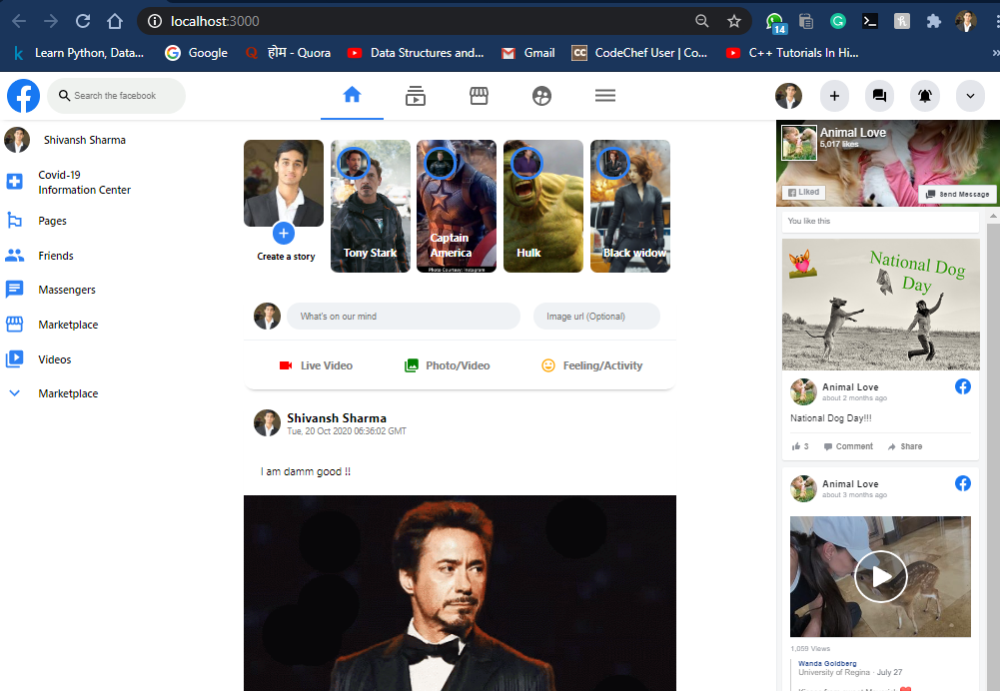

# Facebook Clone with React JS



# [Live facebook clone demo](https://github.com/shivanshsharma13/Coro-Know)

This is just a copy of the world leading social media, facebook. The best way of learning a new skill is by making projects. This is my fist major project. As facebook itself uses react for making things.

## Key Points

- This is fully functional facebook clone
- Frontend by React and Material UI
- Backend by Firebase
- You can add post in real time
- You can add images from the image URL option
- No reloding as this indeed react
- Google authentication for sign in to facebook

## Clone the project

```
git clone https://github.com/shivkaansh/facebook_clone.git
cd facebook_clone
npm i
npm start
```

Made with ❤️ and React
